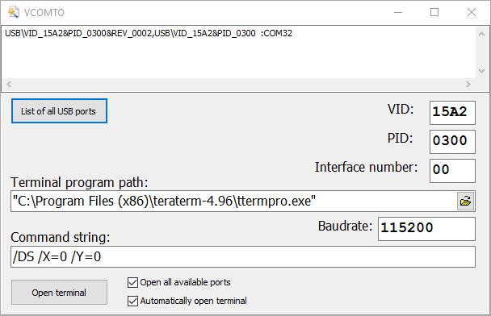

# VCOM_Terminal_opener

Утилита реагирует на событие подключение USB дивайса с VCOM портом.
Определяет значения VID, PID и номер интерфеса порта (MI). Если MI нет, то он равняется 0.

Затем если все параметры совпадат с заданными в окне программы, 
то создается управляющая строка для темрминальной программы TeraTerm и запускается сам TeraTerm с номером порта 
соответствующим подключенному дивайсу. 

Если дивайсов с одинаковыми VID, PID, MI подключено несколько, то программа откроет каждому свое окно TeraTerm. 
